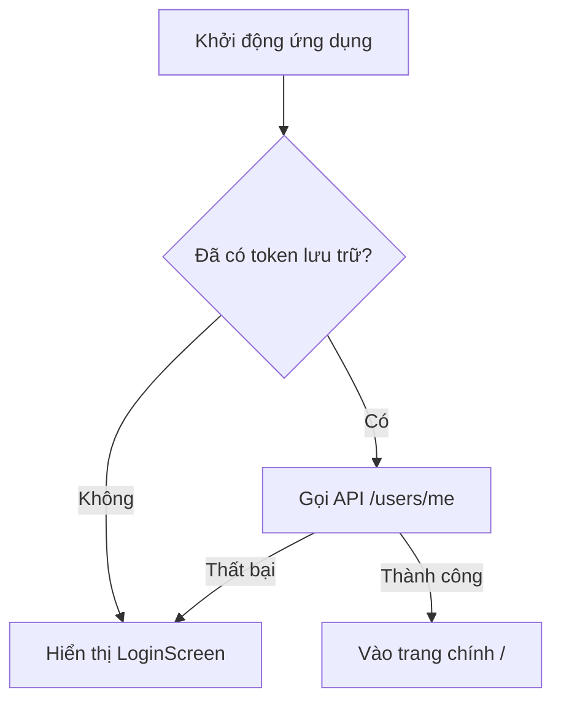

# Tài Liệu Kỹ Thuật Dự Án ScoreKeeper (Dành Cho AI)

Tài liệu này tổng hợp toàn bộ cấu trúc kiến trúc, nghiệp vụ, quản lý trạng thái, API và tiêu chuẩn thiết kế của dự án **ScoreKeeper**. Mục tiêu là giúp các AI/Subagents nhanh chóng nắm bắt dự án để phát triển tính năng hoặc sửa lỗi.

---

## 1. Tổng Quan & Công Nghệ (Tech Stack)

ScoreKeeper là một ứng dụng web di động (mobile-first) dùng để ghi và theo dõi điểm số các ván chơi board game.

*   **Framework**: Next.js 15 (sử dụng App Router làm SPA).
*   **Thư viện UI**: React 18.
*   **Quản lý trạng thái (State Management)**: Zustand.
*   **Hiệu ứng/Hoạt ảnh**: Framer Motion.
*   **Hệ thống Style**: Custom Vanilla CSS (sử dụng CSS Variables / Design Tokens).
*   **Tính năng bổ sung**: PWA (next-pwa) hỗ trợ chế độ offline, Google Fonts (Barlow Semi Condensed).
*   **Backend API**: Dự án API backend chạy song song nằm tại thư mục `/Users/luannguyen/BoardGameScoring/backend`. API cục bộ được cấu hình thông qua biến môi trường `NEXT_PUBLIC_API_BASE_URL` trong file `.env.local` (mặc định trỏ đến `http://localhost:5000/api/v1`).

---

## 2. Cấu Trúc Thư Mục (Project Structure)

```
src/
├── api/
│   └── backendService.js       # API Client & Chuẩn hóa dữ liệu đầu ra/vào
├── components/
│   ├── PlayerDot.jsx           # Avatar tròn đại diện người chơi
│   ├── GameCard.jsx            # Component hiển thị thẻ game/lịch sử ván đấu
│   ├── SetupScreen.jsx         # UI thiết lập game & chọn người chơi
│   ├── GameScreen.jsx          # UI chấm điểm ván đấu đang diễn ra
│   ├── GameOverviewScreen.jsx  # UI xem tổng quan game & bảng xếp hạng (Leaderboard)
│   ├── Leaderboard.jsx         # Bảng xếp hạng người chơi
│   ├── ScoreInput.jsx          # UI tăng/giảm điểm (nếu dùng)
│   ├── RoundHistory.jsx        # Lịch sử các vòng đấu dưới dạng bảng
│   ├── HistoryScreen.jsx       # UI xem lịch sử các ván đấu cũ và chi tiết
│   ├── LoadingOverlay.jsx      # Màn hình chờ tải dữ liệu
│   └── Toast.jsx               # Thông báo nổi (Notification toast)
├── store/
│   ├── appDataStore.js         # Lưu trữ cache dữ liệu dùng chung (games, users, history)
│   ├── authStore.js            # Trạng thái đăng nhập và thông tin cá nhân
│   └── gameStore.js            # Trạng thái ván đấu đang chơi cục bộ
├── hooks/
│   └── useToast.js             # Custom hook điều khiển Toast
├── app/
│   ├── forgot-password/page.jsx# Route quên mật khẩu
│   ├── game/page.jsx           # Route màn hình chơi game
│   ├── history/                # Route lịch sử ván đấu
│   │   ├── page.jsx            # Danh sách ván đấu
│   │   └── [id]/page.jsx       # Chi tiết một ván đấu cụ thể
│   ├── layout.jsx              # Next.js Root Layout (cấu hình fonts, metadata, viewport)
│   ├── manifest.js             # Cấu hình PWA Manifest
│   └── page.jsx                # SPA Client entry point (render App.jsx)
├── styles/                     # Thư mục chứa mã nguồn CSS mô-đun
│   ├── base/                   # reset.css, variables.css, typography.css
│   ├── components/             # button.css, card.css, loading.css, v.v.
│   ├── features/               # CSS riêng cho từng màn hình
│   ├── layout/                 # container.css, grid.css
│   ├── utils/                  # helpers.css, spacing.css
│   └── main.css                # Điểm tập hợp toàn bộ CSS
├── App.jsx                     # Shell chính điều phối màn hình & định tuyến Client-side
├── index.css                   # File CSS đầu vào của Next.js (import styles/main.css)
└── vercel.json                 # Cấu hình deploy Vercel
```

---

## 3. Quản Lý Trạng Thế (Zustand Stores)

Hệ thống quản lý trạng thái được chia làm 3 Store độc lập:

### 3.1. `useAuthStore` ([authStore.js](file:///Users/luannguyen/BoardGameClient/board-game-scoring/src/store/authStore.js))
Quản lý trạng thái đăng nhập của người dùng.
*   **Trạng thái**: `token` (JWT), `user` (profile người dùng hiện tại), `isAuthLoading` (đang xác thực), `hasBootstrapped` (đã khởi tạo kiểm tra token).
*   **Hành động chính**:
    *   `bootstrap()`: Chạy khi khởi động, đọc token từ localStorage và gọi API `/users/me` lấy profile. Nếu lỗi, xóa token.
    *   `login(email, password)`: Gọi API đăng nhập, lưu token và cập nhật profile.
    *   `logout()`: Xóa token khỏi localStorage và reset state.

### 3.2. `useAppDataStore` ([appDataStore.js](file:///Users/luannguyen/BoardGameClient/board-game-scoring/src/store/appDataStore.js))
Lưu trữ và cache các danh mục dùng chung lấy từ API. Có cơ chế Time-To-Live (TTL) để tránh gọi API quá nhiều.
*   **Cơ chế Cache**:
    *   `boardGames`: TTL = 5 phút.
    *   `users`: TTL = 5 phút.
    *   `history`: TTL = 30 giây.
*   **Hành động chính**:
    *   `fetchBoardGames({ force })`, `fetchUsers({ force })`, `fetchHistory({ force })`: Kiểm tra xem dữ liệu trong cache còn hạn (`isFresh()`) không. Nếu không, thực hiện gọi API để cập nhật dữ liệu.
    *   `invalidateBoardGames()`, `invalidateUsers()`, `invalidateHistory()`: Đặt thời điểm fetch về `0` để buộc lần gọi tiếp theo phải tải lại từ API.

### 3.3. `useGameStore` ([gameStore.js](file:///Users/luannguyen/BoardGameClient/board-game-scoring/src/store/gameStore.js))
Quản lý trạng thái của ván đấu đang thiết lập hoặc đang diễn ra cục bộ trên máy khách. Có lưu dự phòng trạng thái `darkMode`.
*   **Trạng thái**:
    *   `gameName`, `boardGameId`: ID và tên game được chọn.
    *   `gameFlow`: Trạng thái luồng chơi (`'overview'` | `'setup'` | `'entry'`).
    *   `scoringType`: Cách tính điểm của game (`'COLUMN_BASED'` | `'WINNER_ONLY'` | `'TOTAL_SCORE_ONLY'`).
    *   `players`: Danh sách người chơi tham gia ván đấu (gồm `id`, `name`, `apiUserId`, `color`, `avatar_url`).
    *   `categories`: Danh sách các cột điểm cần nhập (đối với COLUMN_BASED).
    *   `publishedScores`: Lưu bảng điểm hiện tại.
    *   `syncStatus`: Trạng thái đồng bộ lên server (`'idle'` | `'syncing'` | `'synced'` | `'offline'`).
*   **Hành động chính**:
    *   `selectGame(game)`: Khởi tạo thông tin game được chọn, reset các cột điểm `categories` phù hợp.
    *   `addPlayer(name, apiUserId, avatar)`: Thêm người chơi mới vào ván đấu cục bộ và tạo cấu trúc dòng điểm tương ứng.
    *   `publishScores(scoreRows, description)`:
        1. Đồng bộ hóa những người chơi tự nhập (chưa có `apiUserId`) lên database thông qua API `/users/sync` (sử dụng tên làm định danh, tự động tạo email ảo `<slugify(name)>@scorekeeper.local`).
        2. Đảm bảo game tồn tại trên server thông qua `ensureBoardGame`.
        3. Tạo ván đấu mới thông qua `createMatch`.
        4. Cập nhật kết quả điểm số (`playerScores` hoặc `winnerIds` tùy theo `scoringType`) qua `updateMatchScores`.
        5. Gọi invalidate các cache ở `useAppDataStore` để làm mới danh sách.

---

## 4. API & Chuẩn Hóa Dữ Liệu (`backendService.js`)

Mọi giao tiếp mạng đều đi qua [backendService.js](file:///Users/luannguyen/BoardGameClient/board-game-scoring/src/api/backendService.js).

### 4.1. Cơ chế hoạt động
*   Đầu đọc token JWT tự động được chèn vào header `Authorization: Bearer <token>` thông qua hàm `request()`.
*   Có các cơ chế normalize dữ liệu trả về từ API nhằm chuẩn hóa sự khác biệt giữa snake_case/nested object của Backend sang camelCase phẳng ở Frontend.

### 4.2. Các hàm chuẩn hóa quan trọng:
*   `normalizeBoardGame(game)`: Chuyển đổi cấu trúc `score_columns` hoặc `categories` thành danh sách cột điểm `categories`.
*   `normalizeMatch(match)`: Chuẩn hóa ván đấu hiển thị trên danh sách lịch sử. Xác định người thắng cuộc (`winner`) dựa trên `winner_ids` hoặc người có số điểm cao nhất. Định dạng ngày chơi sang `HH:MM - DD/MM/YYYY`.
*   `normalizeMatchDetail(payload)`: Chuẩn hóa chi tiết một ván đấu gồm danh sách người chơi chi tiết (`players`) xếp hạng từ cao xuống thấp và phân bổ điểm số của họ vào các hàng tương ứng (`scoreRows`).

---

## 5. Luồng Nghiệp Vụ Chính (Core Business Flows)

### 5.1. Xác thực người dùng (Auth)
Nếu client chưa có token hoặc chưa đăng nhập:
1.  [App.jsx](file:///Users/luannguyen/BoardGameClient/board-game-scoring/src/App.jsx) chặn hiển thị giao diện chính và chuyển hướng sang `LoginScreen` hoặc `ForgotPasswordScreen`.
2.  Sau khi đăng nhập thành công, token được lưu vào localStorage, trigger `bootstrap()` để tải thông tin tài khoản và mở khóa giao diện chính.



### 5.2. Luồng thiết lập ván đấu (`SetupScreen`)
1.  **Chọn game (`setupStep === 'games'`)**: Hiển thị danh sách các board game có sẵn trên hệ thống. Hỗ trợ lọc theo số người chơi thích hợp, thể loại và tìm kiếm theo tên. Nhấp vào một game sẽ chọn game đó và chuyển bước sang `config`.
2.  **Thiết lập thông tin (`setupStep === 'config'`)**:
    *   Hiển thị danh sách người chơi đã tham gia.
    *   Cho phép xóa hoặc thêm người chơi. Để thêm người chơi, nhấp "Thêm người chơi" để mở `player-picker` (chọn từ danh sách thành viên hệ thống).
    *   Cho phép chọn ngày giờ chơi (`playDateTime`).
3.  **Tạo bảng điểm**: Nhấp nút "Tạo bảng điểm" để chuyển luồng chơi (`gameFlow`) sang `'entry'` (hiển thị `GameScreen`).

### 5.3. Luồng chấm điểm & Lưu kết quả (`GameScreen`)
Giao diện hiển thị bảng nhập điểm dựa vào `scoringType` của game được chọn:
*   **`WINNER_ONLY`**: Hiển thị danh sách người chơi kèm checkbox. Người dùng tích chọn duy nhất một người chiến thắng.
*   **`TOTAL_SCORE_ONLY`**: Hiển thị grid điểm chỉ có duy nhất 1 hàng nhập điểm (thường là tổng điểm trực tiếp).
*   **`COLUMN_BASED`**: Hiển thị grid điểm gồm nhiều cột đại diện người chơi, nhiều hàng đại diện cho các danh mục điểm (`categories`). Hệ thống tự động tính tổng điểm theo thời gian thực (real-time).

Khi nhấn "Lưu kết quả":
1.  Gửi dữ liệu điểm lên API thông qua `publishScores`.
2.  Sau khi lưu thành công, hệ thống tự động reset danh sách người chơi cục bộ và chuyển hướng người dùng sang trang Lịch sử `/history`.

### 5.4. Xem và quản lý lịch sử ván đấu (`HistoryScreen`)
*   **Danh sách**: Hiển thị toàn bộ các ván chơi đã lưu từ trước đến nay, sắp xếp từ mới nhất đến cũ nhất. Hỗ trợ tìm kiếm theo mô tả ván chơi hoặc lọc theo tên board game.
*   **Chi tiết ván chơi**: Khi click vào một ván chơi, ứng dụng chuyển hướng sang route `/history/[id]`, kích hoạt tải chi tiết ván đấu từ API `/matches/:id`.
    *   Hệ thống dùng hàm `alignScoreRowsWithBoardGame` để ánh xạ chính xác điểm của từng người chơi vào các cột danh mục tương ứng của board game đó.
    *   Hiển thị tùy chọn xóa ván đấu (gọi API `DELETE /matches/:id`).

---

## 6. Hệ Thống Styling & Hướng Dẫn Thiết Kế (Design System)

Dự án áp dụng phong cách thiết kế **Rich Aesthetics** với các quy chuẩn:

### 6.1. Design Tokens ([variables.css](file:///Users/luannguyen/BoardGameClient/board-game-scoring/src/styles/base/variables.css))
*   **Bảng màu**: Sử dụng hệ màu đất ấm áp ấm cúng, sang trọng.
    *   `--color-bg`: Màu nền chính (`#f2e6dc`).
    *   `--color-card`: Màu nền thẻ (`#fffaf7`).
    *   `--color-brand`: Nâu hạt dẻ thương hiệu (`#93653f`).
    *   `--color-accent`: Vàng hổ phách nổi bật (`#f1a625`).
    *   `--color-success`: Xanh lá dịu (`#4caf67`).
    *   `--color-danger`: Đỏ gạch ấm (`#bb6250`).
*   **Kiểu chữ (Typography)**: Font Barlow Semi Condensed được cấu hình trên toàn bộ ứng dụng, với font-family chính `--font-main`.
*   **Bo góc (Radius)**: Các thành phần UI có độ bo góc mềm mại lớn (`--radius-xl: 22px`, `--radius-lg: 18px`).
*   **Chế độ sáng tối**: Sử dụng lớp `.theme-light` trên thẻ `<html>` để điều khiển đảo màu sắc.

### 6.2. Tiêu chuẩn thiết kế & CSS
*   Không sử dụng Tailwind CSS hay các thư viện CSS tiện ích ad-hoc.
*   Tách biệt CSS rõ ràng theo cấu trúc thư mục `src/styles`. Mọi CSS mới phải được khai báo trong file tương ứng và được import vào [main.css](file:///Users/luannguyen/BoardGameClient/board-game-scoring/src/styles/main.css).
*   Giao diện phải hoàn toàn thích ứng (Responsive) trên màn hình di động, sử dụng grid và flexbox linh hoạt.
*   Tránh sử dụng các màu cơ bản thô (như thuần đỏ, thuần xanh). Sử dụng hiệu ứng hover mượt mà và chuyển cảnh tinh tế để tăng trải nghiệm người dùng (Wow effect).

### 6.3. Component Button Tái Sử Dụng ([Button.jsx](file:///Users/luannguyen/BoardGameClient/board-game-scoring/src/components/ui/Button.jsx))
Component `Button` dùng chung được thiết kế đặc thù tối ưu cho giao diện di động (mobile-first), cung cấp trải nghiệm tương tác trực quan cao:
*   **Các Variants**:
    *   `primary`: Nền nâu thương hiệu (`--color-brand-600`), chữ trắng. Dùng cho các hành động chính (Lưu kết quả, Đăng nhập, Bắt đầu).
    *   `secondary`: Nền kem đào ấm (`--color-brand-100`), chữ nâu đậm (`--color-brand-700`). Dùng cho hành động phụ hoặc nổi bật vừa phải.
    *   `outline`: Nền trắng, viền xám nhạt (`--color-gray-12`), chữ đen xám (`--color-gray-80`). Dùng cho nút phụ hoặc nút trạng thái thường.
    *   `ghost`: Trong suốt, chữ nâu đậm (`--color-brand-700`). Dùng cho các liên kết hành động dạng văn bản hoặc nút icon tối giản.
*   **Props quan trọng**:
    *   `variant` (`'primary' | 'secondary' | 'outline' | 'ghost'`): Kiểu dáng nút.
    *   `size` (`'sm' | 'md' | 'lg'`): Kích thước nút (độ cao tương ứng `36px`, `48px`, `56px`).
    *   `leftIcon` / `rightIcon` (`ReactNode`): Icon hiển thị bên trái hoặc bên phải của chữ.
    *   `disabled` (`boolean`): Chặn click và tự động chuyển sang trạng thái disabled chuẩn Figma (Primary nền kem đào chữ mờ, Secondary nền kem hồng chữ cam đào mờ, Outline viền xám nhạt chữ xám mờ, Ghost chữ xám mờ).
*   **Tương tác Mobile-first**:
    *   **Loại bỏ Hover & Focus**: Tránh hiện tượng sticky hover trên di động.
    *   **Phản hồi chạm (Active State)**: Khi bấm xuống (`:active`), nút co lại nhẹ (`scale(0.98)`) kết hợp đổi màu nền sẫm/nhạt hơn một chút tùy theo variant để tạo cảm giác xúc giác phản hồi chân thực.
    *   **Đồng bộ Icon**: Hỗ trợ tự động ép màu các icon custom (`.custom-icon`) bên trong nút disabled kế thừa màu chữ `currentColor` tương ứng.

---


## 7. Cấu Trúc Cơ Sở Dữ Liệu Backend (Tham Khảo)

Dự án Backend nằm tại thư mục `/Users/luannguyen/BoardGameScoring/backend` sử dụng MongoDB và Mongoose ORM. Dưới đây là các schema chính hỗ trợ đồng bộ:

### 7.1. BoardGame ([BoardGame.ts](file:///Users/luannguyen/BoardGameScoring/backend/src/models/BoardGame.ts))
*   `name`: Tên game.
*   `min_players` / `max_players`: Số người chơi tối thiểu và tối đa.
*   `scoring_type`: Kiểu tính điểm (`COLUMN_BASED` | `WINNER_ONLY` | `TOTAL_SCORE_ONLY`).
*   `score_columns`: Mảng các cột điểm (`id`, `name`, `type`, `icon_url`).

### 7.2. Match ([Match.ts](file:///Users/luannguyen/BoardGameScoring/backend/src/models/Match.ts))
*   `board_game_id`: ID của game (ref `BoardGame`).
*   `created_by`: ID người tạo (ref `User`).
*   `play_date`: Thời điểm chơi.
*   `player_count`: Số người tham gia.
*   `description`: Mô tả ván chơi.

### 7.3. MatchPlayer ([MatchPlayer.ts](file:///Users/luannguyen/BoardGameScoring/backend/src/models/MatchPlayer.ts))
*   `match_id`: ID ván chơi (ref `Match`).
*   `user_id`: ID người chơi (ref `User`).
*   `scores`: Map lưu trữ điểm số của từng cột điểm `{ [columnId]: scoreValue }`.
*   `total_score`: Tổng số điểm của người chơi đó.
*   `rank`: Thứ hạng trong ván.
*   `is_winner`: Đánh dấu là người chiến thắng.

